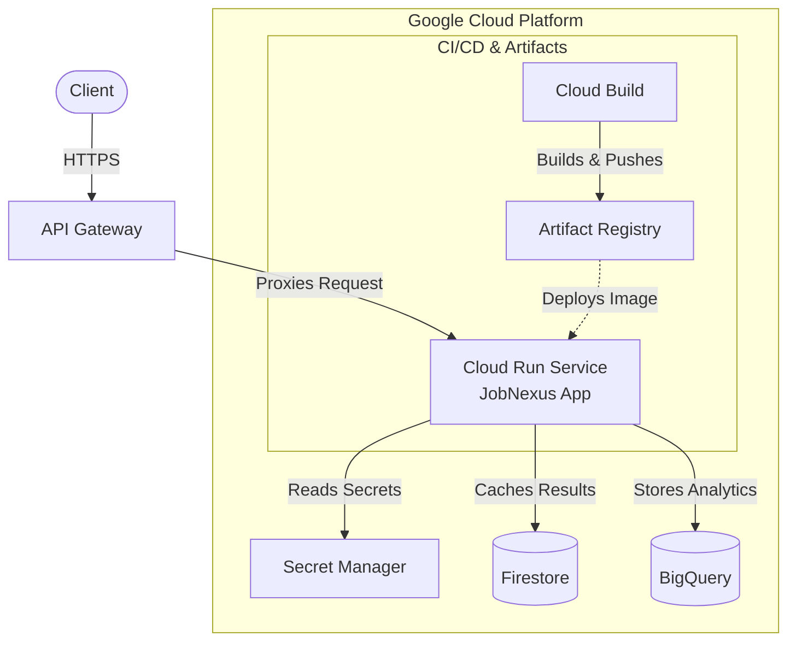

# JobNexus

JobNexus is a high-performance, centralized API designed to aggregate job offers from multiple major platforms in France. It provides a unified interface for searching job opportunities across **APEC**, **La Bonne Alternance** (France Travail), and **Welcome to the Jungle**, streamlining the recruitment and job search process for developers and candidates.

Built with performance and scalability in mind, JobNexus utilizes **FastAPI**, **Google Cloud Platform (GCP)**, and **Terraform** for a fully cloud-native infrastructure.

## Architecture

The following diagram illustrates the Google Cloud Platform infrastructure provisioned by Terraform.



## Features

* **Multi-Source Aggregation**: Real-time fetching and normalization of job offers from:
    * **La Bonne Alternance**: Apprenticeship and vocational training offers.
    * **APEC**: Executive and specialist jobs.
    * **Welcome to the Jungle**: Tech and startup ecosystem jobs.
* **Unified Data Model**: Transforms disparate external API responses into a standardized `Job` object.
* **ROME Code Integration**: Automatic lookup of ROME (Répertoire Opérationnel des Métiers et des Emplois) codes to optimize queries against France Travail services.
* **Smart Caching**: Implements **Google Cloud Firestore** to cache search results (TTL 24h), reducing latency and preserving external API quotas.
* **Data Analytics**: Asynchronously archives search results to **Google BigQuery** for market trend analysis and reporting.
* **Infrastructure as Code**: Complete deployment managed via **Terraform** (Cloud Run, API Gateway, Secret Manager).
* **CI/CD**: Automated build and deployment pipeline using **Google Cloud Build**.

## Tech Stack

* **Language**: Python 3.14
* **Framework**: [FastAPI](https://fastapi.tiangolo.com/)
* **Package Manager**: [Poetry](https://python-poetry.org/)
* **Containerization**: Docker (Multi-stage builds)
* **Cloud Provider**: Google Cloud Platform (GCP)
    * **Compute**: Cloud Run (Serverless)
    * **Database**: Firestore (NoSQL Cache)
    * **Data Warehouse**: BigQuery
    * **Security**: Secret Manager, IAM
    * **Gateway**: API Gateway
* **IaC**: Terraform

## Project Structure

```bash
jobnexus/
├── main.py                 # Application entry point and API routes
├── services/               # Core business logic and external API clients
│   ├── orchestrator.py     # Manages aggregation strategy
│   ├── apec.py             # APEC connector
│   ├── labonnealternance.py# LBA connector
│   ├── wttj.py             # Welcome to the Jungle connector
│   ├── rome.py             # France Travail ROME lookup
│   ├── cache.py            # Firestore caching logic
│   └── data.py             # BigQuery ingestion logic
├── models/                 # Pydantic data models
├── terraform/              # Infrastructure definitions
├── Dockerfile              # Multi-stage build configuration
├── cloudbuild.yaml         # CI/CD pipeline definition
└── pyproject.toml          # Dependency management
```

## Getting Started

### Prerequisites

* Python 3.14+
* [Poetry](https://python-poetry.org/docs/#installation)
* [Docker](https://docs.docker.com/get-docker/) (optional, for containerized run)
* GCP Account (if deploying or using cloud resources)

### Installation

1.  **Clone the repository**
    ```bash
    git clone https://github.com/loicck/jobnexus.git
    cd jobnexus
    ```

2.  **Install dependencies**
    ```bash
    poetry install
    ```

3.  **Environment Configuration**
    Create a `.env` file based on the example provided:
    ```bash
    cp .env.example .env
    ```
    Fill in your API keys and credentials:
    ```ini
    FT_CLIENT_ID=your_france_travail_client_id
    FT_CLIENT_SECRET=your_france_travail_client_secret
    LBA_API_KEY=your_lba_api_key
    WTTJ_APP_ID=your_wttj_app_id
    WTTJ_API_KEY=your_wttj_api_key
    BIGQUERY_TABLE_ID=your_project.dataset.table
    ```

### Running Locally

**Using Poetry:**
```bash
poetry run uvicorn main:app --reload --host 0.0.0.0 --port 8000
```

**Using Docker:**
```bash
docker build -t jobnexus .
docker run -p 8080:8080 --env-file .env jobnexus
```

Access the API documentation at `http://localhost:8080/docs`.

## API Endpoints

| Method | Endpoint | Description |
| :--- | :--- | :--- |
| `GET` | `/search` | **Main Aggregator**. Searches jobs across all configured providers based on query, location, and radius. |
| `GET` | `/lba` | Direct search on La Bonne Alternance. |
| `GET` | `/apec` | Direct search on APEC. |
| `GET` | `/wttj` | Direct search on Welcome to the Jungle. |
| `GET` | `/rome` | Search for ROME codes by job title (e.g., "Ingénieur Cloud"). |
| `GET` | `/health` | Health check endpoint. |

## Deployment

### Infrastructure (Terraform)

The `terraform/` directory contains the configuration to provision the required GCP resources.

1.  **Initialize Terraform**
    ```bash
    cd terraform
    terraform init
    ```

2.  **Plan & Apply**
    ```bash
    terraform plan -var="project_id=YOUR_PROJECT_ID"
    terraform apply -var="project_id=YOUR_PROJECT_ID"
    ```

### CI/CD (Cloud Build)

The `cloudbuild.yaml` file defines the pipeline triggered on push:
1.  Builds the Docker image.
2.  Pushes the image to Google Artifact Registry.
3.  Deploys the new revision to Cloud Run.

## License

Distributed under the MIT License.
