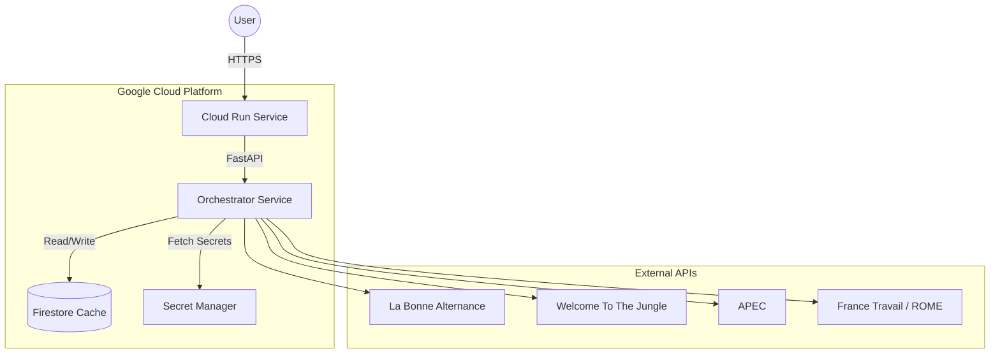

# JobNexus

**JobNexus** is a Serverless apprenticeship aggregator designed to simplify job hunting for students. It consolidates offers from multiple major French platforms into a single, unified REST API.

Built with a **Cloud-First** approach, it leverages **Google Cloud Platform** to ensure scalability and cost-efficiency (Scale-to-Zero).

## Architecture

The application is designed as a **Serverless Microservice**. The orchestration logic handles data fetching, normalization, and caching to reduce latency and external API calls.



## Tech Stack

| Domain | Technology | Usage |
|:---|:---|:---|
| **Core** |   | High-performance API & Business Logic |
| **Compute** | **Google Cloud Run** | Serverless Container Hosting |
| **Database** | **Google Firestore** | NoSQL Database for caching job results |
| **DevOps** | **Docker** | Containerization (Multi-stage build) |
| **CI/CD** | **Cloud Build** | Automated GitOps pipeline |
| **Security** | **Secret Manager** | Secure management of API Keys at runtime |
| **Registry** | **Artifact Registry** | Secure Docker image storage |

## CI/CD & Automation

This project follows a **GitOps** methodology. Every push to the `main` branch triggers a fully automated pipeline via **Google Cloud Build** defined in [`cloudbuild.yaml`](./cloudbuild.yaml).

**Pipeline Steps:**
1.  **Build**: Creates a Docker image based on the `Dockerfile`.
2.  **Push**: Uploads the artifact to **Google Artifact Registry** (`europe-west9`).
3.  **Deploy**: Deploys the new revision to **Cloud Run** with the following production configuration:
    * **Region**: `europe-west9` (Paris)
    * **Security**: Environment variables are injected dynamically via **GCP Secret Manager** (no hardcoded secrets).
    * **Access**: Publicly accessible (`--allow-unauthenticated`).

## Performance & FinOps Strategy

As a student project, cost optimization is a priority.

* **Scale-to-Zero**: Hosting on **Cloud Run** ensures that no compute costs are incurred when the API is idle.
* **Smart Caching**: To reduce latency and avoid hitting external API rate limits, requests are cached in **Firestore**.
    * *Logic*: The Orchestrator checks Firestore first. If a valid cache entry exists (**TTL: 24h**), it serves it immediately (< 50ms). If not, it fetches live data and updates the cache.

## Features

- **Multi-source Aggregation**: Unifies job offers from:
  - **La Bonne Alternance**
  - **Welcome to the Jungle**
  - **APEC**
  - **France Travail** (via ROME service for precise categorization)
- **Unified Search**: A single endpoint to query all platforms simultaneously.
- **Developer Experience**: Automatic interactive documentation (Swagger UI).

## Local Development (via Docker)

You can run the full stack locally using Docker to replicate the production environment.

**Prerequisites:**
- Docker installed
- A `.env` file with your API keys (see `.env.example`)

```bash
# 1. Build the Docker image
docker build -t jobnexus .

# 2. Run the container (injecting environment variables)
docker run -p 8080:8080 --env-file .env jobnexus
```

The API will be available at `http://127.0.0.1:8080`.

## API Documentation

FastAPI automatically generates interactive API documentation. Once running:

- **Swagger UI:** [http://127.0.0.1:8080/docs](http://127.0.0.1:8080/docs)
- **ReDoc:** [http://127.0.0.1:8080/redoc](http://127.0.0.1:8080/redoc)

## License

This project is licensed under the MIT License - see the [LICENSE](LICENSE) file for details.