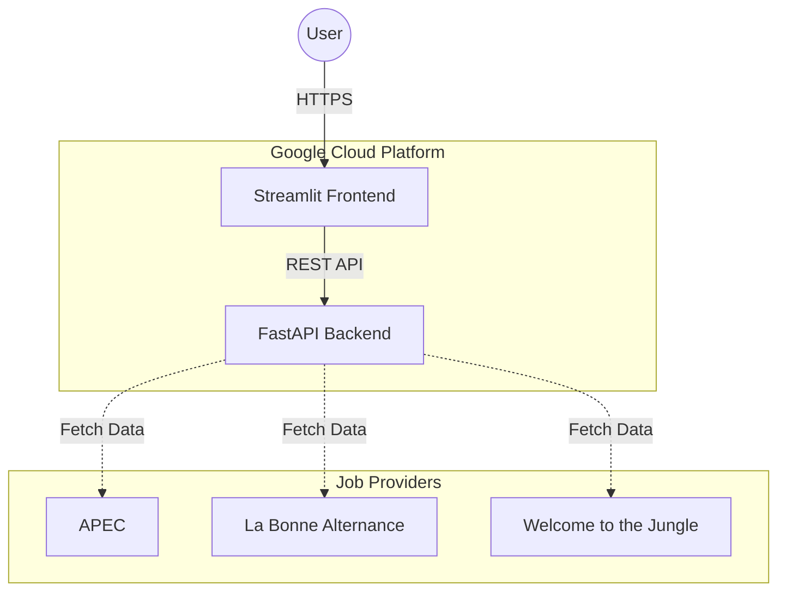

# JobNexus

JobNexus is an **Apprenticeship** job aggregation platform that consolidates listings from multiple French job boards (APEC, La Bonne Alternance, Welcome to the Jungle) into a unified interface. It uses ROME codes to standardize job categories across different providers.



## Architecture

The project is divided into three main components:

* **Backend**: A FastAPI application that orchestrates data fetching, normalization, and caching.

* **Frontend**: A Streamlit application providing a user-friendly interface to search and view jobs.

* **Infrastructure**: Managed via Terraform on Google Cloud Platform (Cloud Run, API Gateway).

### Tech Stack

* **Language**: Python 3.14

* **Package Manager**: Poetry

* **Backend Framework**: FastAPI

* **Frontend Framework**: Streamlit

* **Infrastructure**: Terraform, Docker, Google Cloud Run

## Getting Started

### Prerequisites

* [Docker](https://www.docker.com/)

* [Poetry](https://python-poetry.org/)

* [GCP CLI](https://cloud.google.com/sdk/docs/install) (for deployment)

### 1. Backend Setup

The backend exposes the API endpoints used to fetch job data.

1. Navigate to the backend directory:

   ```bash
   cd backend
   ```

2. Install dependencies:

   ```bash
   poetry install
   ```

3. Set up environment variables:

   ```bash
   cp .env.example .env
   # Edit .env with your API keys (APEC, France Travail, etc.)
   ```

4. Run the server locally:

   ```bash
   poetry run uvicorn main:app --reload
   ```

   The API will be available at `http://localhost:8000`.

### 2. Frontend Setup

The frontend is a dashboard for interacting with the API.

1. Navigate to the frontend directory:

   ```bash
   cd frontend
   ```

2. Install dependencies:

   ```bash
   poetry install
   ```

3. Set up environment variables:

   ```bash
   cp .env.example .env
   # Ensure Backend URL is set correctly
   ```

4. Run the Streamlit app:

   ```bash
   poetry run streamlit run app.py
   ```

   The UI will be available at `http://localhost:8501`.

## Docker Support

Both services include Dockerfiles for containerized execution.

**Build and Run Backend:**

```bash
cd backend
docker build -t jobnexus-backend .
docker run -p 8000:8080 --env-file .env jobnexus-backend
```

**Build and Run Frontend:**

```bash
cd frontend
docker build -t jobnexus-frontend .
docker run -p 8080:8080 --env-file .env jobnexus-frontend
```

## Infrastructure & Deployment

Infrastructure is managed as code using **Terraform**.

1. Navigate to the terraform directory:

   ```bash
   cd terraform
   ```

2. Initialize Terraform:

   ```bash
   terraform init
   ```

3. Plan and Apply:

   ```bash
   terraform plan
   terraform apply
   ```

**CI/CD:**
The project uses `cloudbuild.yaml` in both backend and frontend directories to automate builds and deployments to Google Cloud Run triggers.

## License

Distributed under the MIT License. See `LICENSE` for more information.
